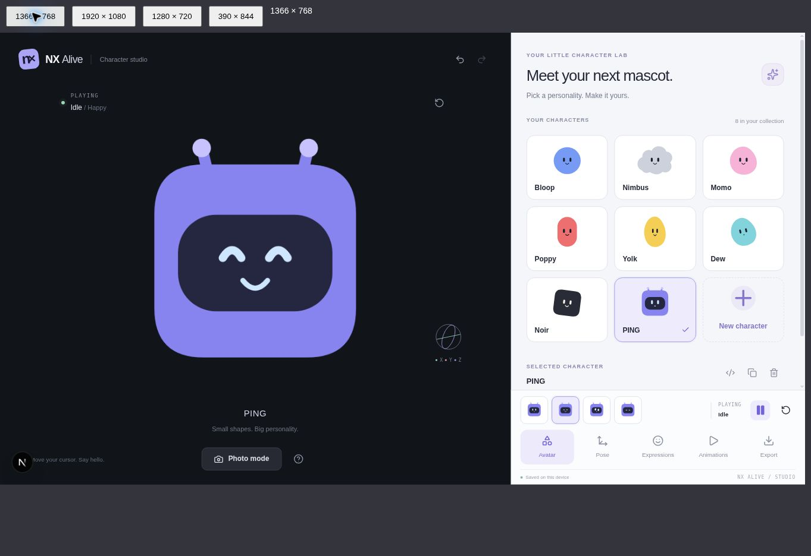
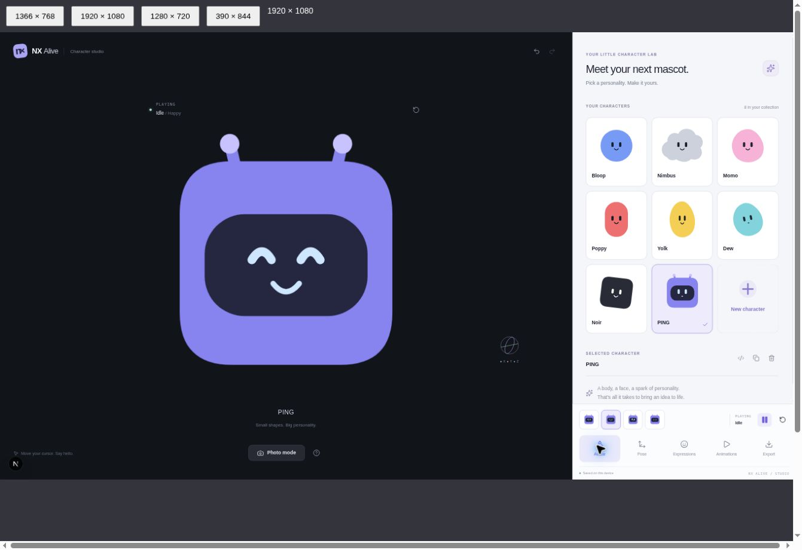

# Character Studio verification

## Automated checks

- `npm run typecheck`: all four workspace packages.
- `npm test`: 30 passing tests (15 core, 8 persistence/history, 4 Studio flows, 3 demo packaging).
- `npm run build`: production bundles for the runtime packages and Next.js Studio.
- `git diff --check`: no whitespace errors.
- No separate lint task is configured in this repository.

Coverage includes document validation, serialization, expression resolution, animation sampling, SVG safety, local persistence/recovery, undo/redo, character creation, pose/expression/animation selection and standalone demo contents.

## Visual and interactive inspection

The Studio was inspected at 1366×768, 1920×1080 and 1280×720. The mobile notice was inspected at 390×844. Desktop dimensions were simulated with a same-origin iframe, scaled to fit the browser capture; screenshot file dimensions are therefore not the simulated viewport dimensions. The temporary harness is not shipped.

- Desktop preview, fixed tabs and playback controls remain visible; the editor scrolls independently.
- Character creation/selection, pose edits, undo/redo, expression selection, playback pause and reload persistence were exercised in the browser.
- JSON copy and JSON/PNG downloads were observed.
- A generated React demo using the actual bundled runtime was extracted, installed and built successfully as a separate Next.js app.

## Verification limitations

- ZIP generation completed in the browser, but the cloud browser did not expose a saved ZIP download. ZIP contents are covered by automated tests; a downloaded ZIP still merits a check in a normal desktop browser.
- The browser environment disconnected during the custom-SVG file chooser test. Safe single-path SVG parsing and rejection of unsafe markup are covered by automated tests, but that final file chooser flow was not completed.
- Schema v2 intentionally rejects experimental v1 documents; no migration is supplied.
- Photo exports capture the static pose and expression, not an intermediate animation frame.
